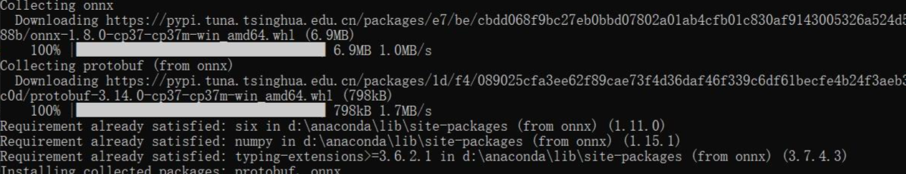

# 模型端侧部署

## 什么是端侧部署？

模型端侧部署（Model Edge Deployment）是指将机器学习模型或深度学习模型部署到边缘设备（如传感器、智能手机、物联网设备等）上运行和执行推断的过程。

传统上，机器学习模型的训练和推断通常在云端或大型服务器上进行。然而，随着物联网和边缘计算的发展，将模型部署到边缘设备上已经成为一种趋势。在某些情况下，将模型部署到边缘设备上可以提供更快的响应时间、减少网络延迟和带宽消耗，并增强数据隐私和安全性。

模型端侧部署涉及将已经训练好的模型转移到边缘设备上，并在设备本地执行推断。这通常需要考虑到边缘设备的计算能力、内存限制和能耗等因素。为了适应边缘设备的资源限制，可能需要对模型进行优化、压缩或量化，以减小模型的大小和计算量。

模型端侧部署还可能涉及到与边缘设备的连接和通信，以便获取输入数据并将推断结果传送回其他系统或云端进行进一步处理和分析。

模型端侧部署是将机器学习模型部署到边缘设备上的过程，以在本地执行推断任务，以实现低延迟、隐私保护和边缘计算的优势。

## 端侧部署必备知识

### 一条主要的技术路线
训练框架训练模型 -> 模型转化为ONNX格式 -> ONNX格式转化为其他格式（NCNN,TNN,MNN的模型格式）-> 在对应的推理框架中部署

### ONNX
大家看到上面的模型转化为ONNX格式可能存在疑惑，这是个什么东西？对，我一开始看到的时候是在把模型部署到昇腾开发者套件上，文档中提到了onnx，下面我就简单讲讲我的见解
> 参考文章：  
> [ONNX学习笔记](https://zhuanlan.zhihu.com/p/346511883)  
> [从端到端打通模型端侧部署流程（NCNN）](https://blog.csdn.net/KingsMan666/article/details/129009255)

#### 什么是ONNX？
官方介绍：ONNX 是一种用于表示机器学习的开放格式 模型。ONNX 定义了一组通用运算符（机器学习和深度学习模型的构建块）和通用文件格式，使 AI 开发人员能够将模型与各种框架、工具、运行时和编译器一起使用。

简单描述一下官方介绍，开放神经网络交换（Open Neural Network Exchange）简称ONNX是微软和Facebook提出用来表示深度学习模型的开放格式。**所谓开放就是ONNX定义了一组和环境，平台均无关的标准格式，来增强各种AI模型的可交互性。**

换句话说，无论你使用何种训练框架训练模型（比如TensorFlow/Pytorch/OneFlow/Paddle），**在训练完毕后你都可以将这些框架的模型统一转换为ONNX这种统一的格式进行存储。** 注意ONNX文件不仅仅存储了神经网络模型的权重，同时也存储了模型的结构信息以及网络中每一层的输入输出和一些其它的辅助信息。

在获得ONNX模型之后，模型部署人员自然就可以将这个模型部署到兼容ONNX的运行环境中去。这里一般还会设计到额外的模型转换工作，典型的比如在Android端利用NCNN部署ONNX格式模型，那么就需要将ONNX利用NCNN的转换工具转换到NCNN所支持的`bin`和`param`格式。

#### ProtoBuf简介
在分析ONNX组织格式前我们需要了解Protobuf, 如果你比较了解Protobuf可以略过此节。 ONNX作为一个文件格式，我们自然需要一定的规则去读取我们想要的信息或者是写入我们需要保存信息。ONNX使用的是Protobuf这个序列化数据结构去存储神经网络的权重信息。熟悉Caffe或者Caffe2的同学应该知道，它们的模型存储数据结构协议也是Protobuf。这个从安装ONNX包的时候也可以看到：
  

Protobuf是一种轻便高效的结构化数据存储格式，可以用于结构化数据串行化，或者说序列化。它很适合做数据存储或数据交换格式。可用于通讯协议、数据存储等领域的语言无关、平台无关、可扩展的序列化结构数据格式。目前提供了 C++、Java、Python 三种语言的 API（摘自官方介绍）。

Protobuf协议是一个以*.proto后缀文件为基础的，这个文件描述了用户自定义的数据结构。如果需要了解更多细节请参考0x7节的资料3，这里只是想表达ONNX是基于Protobuf来做数据存储和传输，那么自然onnx.proto就是ONNX格式文件了，接下来我们就分析一下ONNX格式。

#### ONNX格式分析
这一节我们来分析一下ONNX的组织格式，上面提到ONNX中最核心的部分就是onnx.proto（https://github.com/onnx/onnx/blob/master/onnx/onnx.proto） 这个文件了，它定义了ONNX这个数据协议的规则和一些其它信息。现在是2021年1月，这个文件有700多行，我们没有必要把这个文件里面的每一行都贴出来，我们只要搞清楚里面的核心部分即可。在这个文件里面以message关键字开头的对象是我们需要关心的。我们列一下最核心的几个对象并解释一下它们之间的关系。
```
ModelProto
GraphProto
NodeProto
ValueInfoProto
TensorProto
AttributeProto
```
当我们加载了一个ONNX之后，我们获得的就是一个`ModelProto`，它包含了一些版本信息，生产者信息和一个`GraphProto`。在`GraphProto`里面又包含了四个`repeated`数组，它们分别是`node(NodeProto类型)`，`input(ValueInfoProto类型)`，`output(ValueInfoProto类型)`和`initializer(TensorProto类型)`，其中`node`中存放了模型中所有的计算节点，`input`存放了模型的输入节点，`output`存放了模型中所有的输出节点，`initializer`存放了模型的所有权重参数。

我们知道要完整的表达一个神经网络，不仅仅要知道网络的各个节点信息，还要知道它们的拓扑关系。这个拓扑关系在ONNX中是如何表示的呢？ONNX的每个计算节点都会有`input`和`output`两个数组，这两个数组是`string`类型，通过`input`和`output`的指向关系，我们就可以利用上述信息快速构建出一个深度学习模型的拓扑图。这里要注意一下，`GraphProto`中的`input`数组不仅包含我们一般理解中的图片输入的那个节点，还包含了模型中所有的权重。例如，`Conv`层里面的`W`权重实体是保存在`initializer`中的，那么相应的会有一个同名的输入在`input`中，其背后的逻辑应该是把权重也看成模型的输入，并通过`initializer`中的权重实体来对这个输入做初始化，即一个赋值的过程。

最后，每个计算节点中还包含了一个AttributeProto数组，用来描述该节点的属性，比如Conv节点或者说卷积层的属性包含group，pad，strides等等，每一个计算节点的属性，输入输出信息都详细记录在（https://github.com/onnx/onnx/blob/master/docs/Operators.md。）

在ONNX学习笔记这一篇文章，还有介绍`onnx.helper`，它提供的make_node，make_graph，make_tensor等等接口完成一个ONNX模型的构建，还有